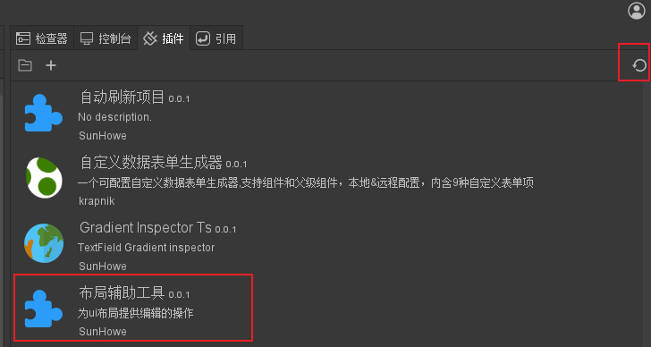
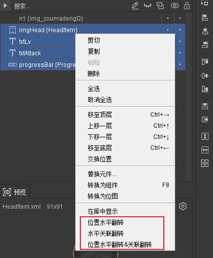
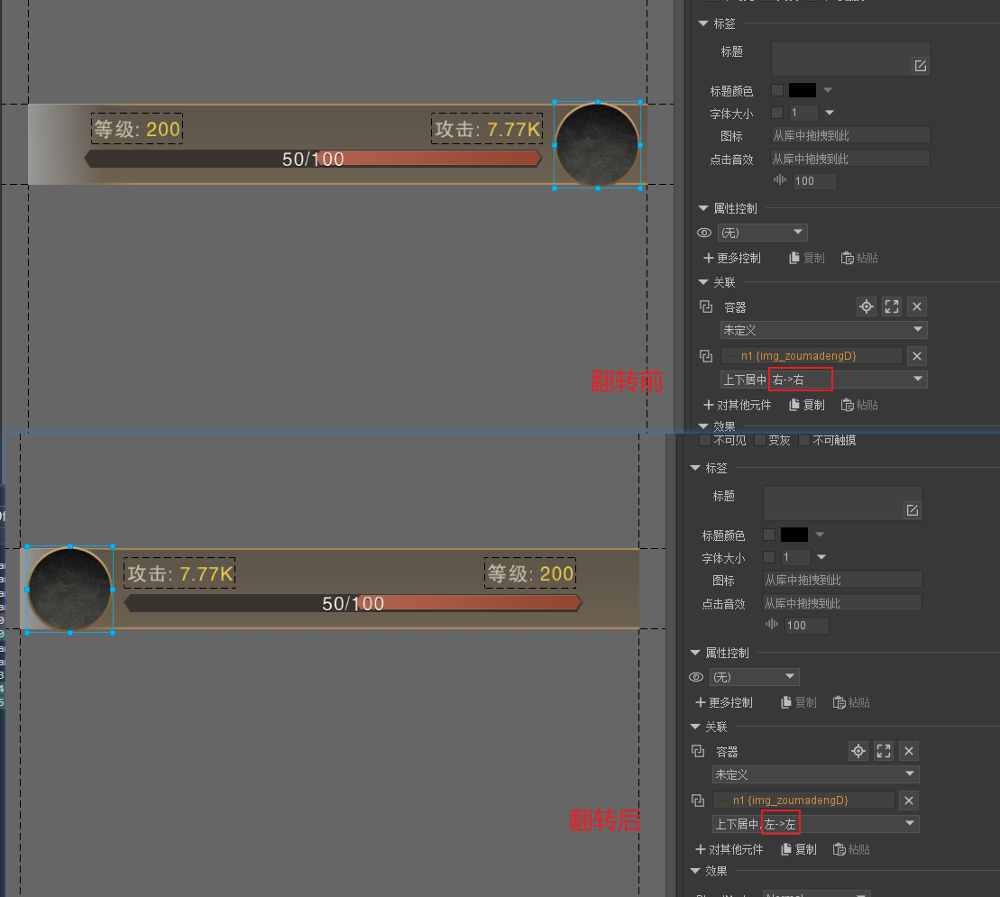

# FairyGUI-Plugin-LayoutUtility

在开发过程中，我们常常会遇到需要对某个组件做一个水平镜像的组件，尤其是在做海外游戏时的UI本地化处理时，像中东国家是从右到左的阅读顺序，所以我们通常要对原本在中文或英文阅读习惯环境下只做的UI进行水平翻转的处理。

而手动进行处理的话，这种工作又枯燥又容易出错，既要调整位置又要调整布局，于是就写了这个布局工具进行辅助处理，它的代码很简单，就是读取组件宽度和子控件的坐标，进行水平对称换算一下，并检测一下其关联系统的设置是否包含水平方向上的关联，如果有，则进行对称处理。

## 使用方式

- 将`LayoutUtility`文件夹拷贝到FairyGUI编辑器或UI工程的`plugins`目录下，然后返回FairyGUI编辑器界面，点击插件分页的刷新按钮，让插件被加载起来。

- 选中需要进行水平翻转的子控件，然后右键

  

- 这里提供了`位置水平翻转`、`水平关联翻转`、`位置水平翻转&关联翻转`三个选项，通常直接点最后一个即可，可以在右侧检查器面板看到其效果

  

- 目前暂未遇到垂直方向翻转的需求，如果有的话，可自行根据水平翻转的写法增加一下功能即可。