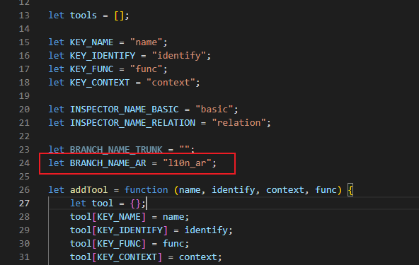
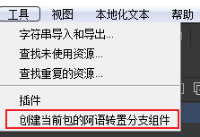

# FairyGUI-Plugin-LayoutUtility

在开发过程中，我们常常会遇到需要对某个组件做一个水平镜像的组件，尤其是在做海外游戏时的UI本地化处理时，像中东国家是从右到左的阅读顺序，所以我们通常要对原本在中文或英文阅读习惯环境下只做的UI进行水平翻转的处理。

而手动进行处理的话，这种工作又枯燥又容易出错，既要调整位置又要调整布局，于是就写了这个布局工具进行辅助处理，它的代码很简单，就是读取组件宽度和子控件的坐标，进行水平对称换算一下，并检测一下其关联系统的设置是否包含水平方向上的关联，如果有，则进行对称处理。

除了水平翻转外，还提供了通用的组件阿语转置功能，其会扫描指定组件或指定包下的所有组件，将其各子节点的位置和水平关联关系进行翻转，并将`List`、`Loader`、`Text`、`RichText`、`InputText`组件的水平对齐方式也进行翻转。

## 使用方式

将`LayoutUtility`文件夹拷贝到FairyGUI编辑器或UI工程的`plugins`目录下，然后返回FairyGUI编辑器界面，点击插件分页的刷新按钮，让插件被加载起来。

### 水平翻转功能

- 选中需要进行水平翻转的子控件，然后右键

  

- 这里提供了`位置水平翻转`、`水平关联翻转`、`位置水平翻转&关联翻转`三个选项，通常直接点最后一个即可，可以在右侧检查器面板看到其效果

  

- 目前暂未遇到垂直方向翻转的需求，如果有的话，可自行根据水平翻转的写法增加一下功能即可。

### 阿语转置功能

- 在初次使用时，先打开插件的`main.js`文件，将其中的`BRANCH_NAME_AR`阿语分支名常量改成你工程中的命名:

  

- 点击`顶部菜单栏-工具-创建当前包的阿语转置分支组件`按钮，即可对当前选中的包下的所有组件进行阿语转置。

  

- 也支持在`资源库`视图中，右键单个组件，选择创建其对应的阿语转置组件，或直接对组件进行阿语转置等功能

  

- 功能预览:

  - 原组件:

    

  - 转置后:

    